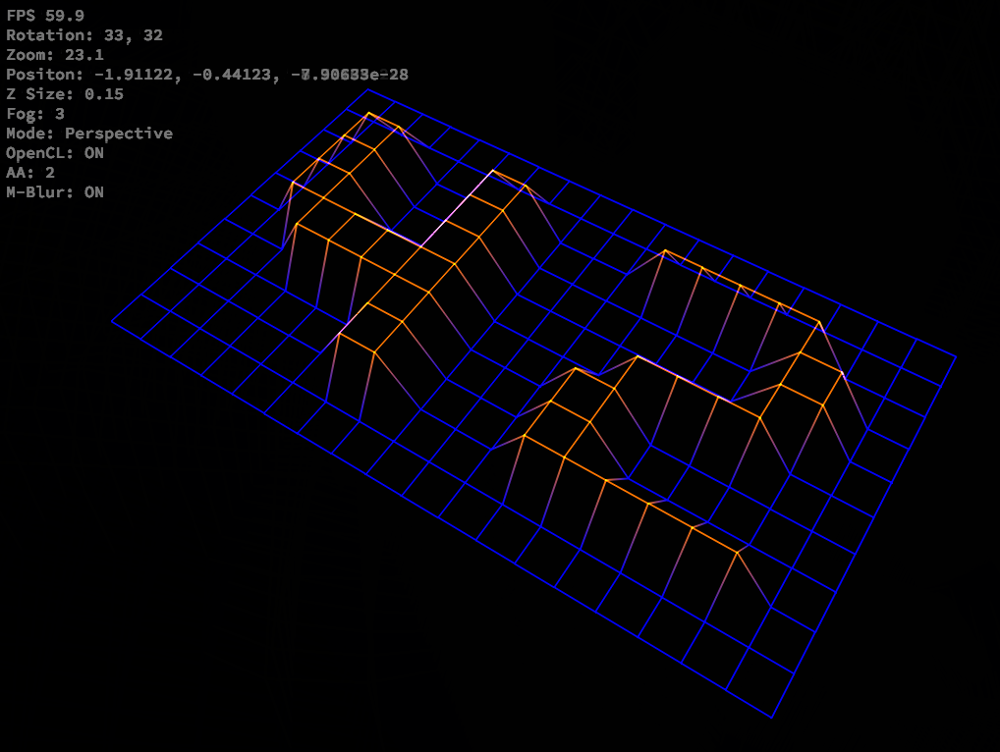
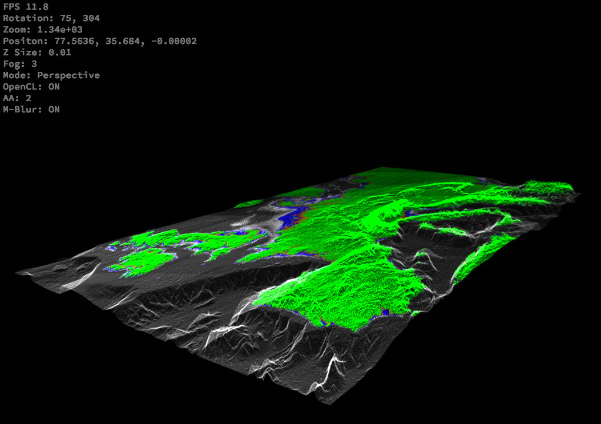

# Fdf

This project is a 3D visualizer that takes a file describing an altitude map as input and creates a wireframe representation of it. The `maps` directory contains a few test maps.
This project uses OpenCL as a primary way do the calculations, however, if OpenCL is unable to initialize, the project will still launch without OpenCL.

---
Controls

The controls were made for Azerty and there is no way to change them for Qwerty keyboards

- ESC : exits the program
- Arrow keys : moves the camera focus forward/backward/left/right
- Space/Shift : moves the camera focus up/down (this control does not scale properly and should probably not be used)
- Mouse wheel : moves the camera closer/further from its focus
- Click and drag : rotates around the focus of the camera
- Alt + Up/down : changes the z scale factor
- P : switches between orthogonal and perspective projections
- C : enables/disables OpenCL
- L : only available if OpenCL is off, switches between 2 line modes

These options are only available if OpenCL is active:
- A : switches between the 3 lines modes (aliased, small anti-aliased, large anti-aliased)
- M : enables/disables motion blur
- F : switches between 4 different "fog" distances (this is an arbitrary formula that decreases the luminosity of the lines the further they are from the camera), 4 disables the fog entierly

---
Examples

